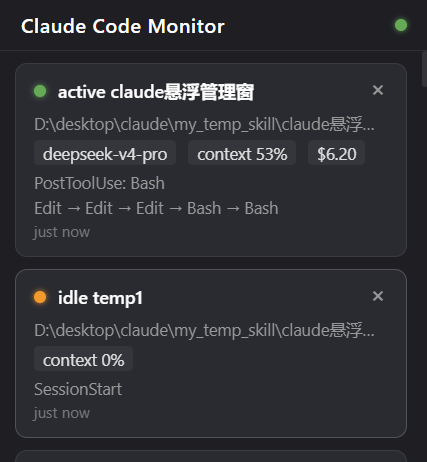
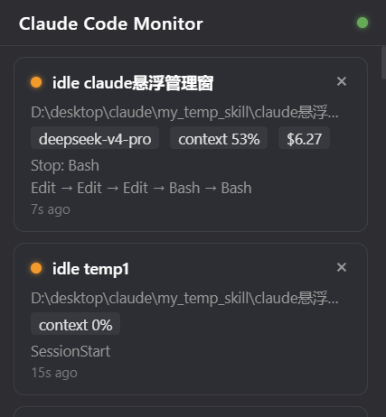
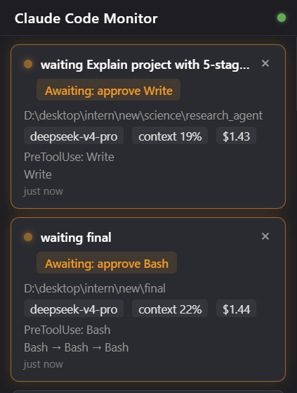

# Claude Code Monitor

Windows 桌面悬浮窗，统一监控本机所有 Claude Code 会话状态。

## 功能

- **实时会话面板** — 悬浮窗列出本机所有运行中的 Claude Code 会话，卡片式展示
- **状态追踪** — 实时显示 active / idle / waiting / stopped 四种状态，状态变化即时推送
- **详情展示** — 模型名称、上下文窗口占用率、累计费用、会话时长、最近使用的工具链
- **权限提醒** — 当 Claude Code 等待用户授权时（permission mode），卡片高亮闪烁并播放提示音
- **停止通知** — 会话结束时卡片闪烁提醒，自动折叠保留 10 秒后清除
- **系统托盘** — 最小化到托盘，右键菜单支持显示/隐藏、重置窗口位置、退出
- **窗口记忆** — 窗口位置和大小自动持久化，重启后恢复
- **单实例锁** — 防止重复启动，二次启动自动激活已有窗口
- **全局快捷键** — `Ctrl+Shift+M` 重置窗口到默认位置

### 会话状态说明

| 状态 | 含义 |
|------|------|
| **active** | 正在执行任务（模型推理中） |
| **idle** | 空闲等待用户输入 |
| **waiting** | 等待用户审批权限 |
| **stopped** | 会话已结束（10 秒后自动清除） |

## 画面演示

打开这个项目，目前运行了几个claude就可以看到几个：



任务运行完成后，就变成idle模式：



当需要审批权限时：



点击x号在面板中隐藏这个claude（实际进程中还是一样在运行的）

## 工作原理

```
┌──────────────────────────────────────────┐
│  Claude Code 进程                         │
│  ├─ 写入 PID 文件 (~/.claude/sessions/)    │
│  ├─ statusLine → PowerShell → HTTP POST   │
│  └─ hooks → PowerShell → HTTP POST        │
└──────────────────┬───────────────────────┘
                   │
                   ▼
┌──────────────────────────────────────────┐
│  Claude Code Monitor (Electron)           │
│  ├─ Express HTTP Server (:4317)            │
│  ├─ PID 文件轮询 (500ms)                   │
│  ├─ JSONL 转录尾随 (权限检测 fallback)      │
│  └─ 双数据源融合 → 状态机驱动 UI 推送       │
└──────────────────────────────────────────┘
```

双数据源设计：
- **PID 文件** — 进程存活的权威来源，包含 cwd、sessionId、status 等基础信息
- **HTTP hooks / statusLine** — 元信息补充层，提供 model、cost、context%、tool 等丰富数据

两路数据在 `sessions.js` 状态机中融合，形成完整的会话视图，通过 IPC 推送到前端（无轮询）。

## 环境要求

- **Windows 10/11**（仅支持 Windows）
- **Node.js >= 18**
- **PowerShell 5.1+**（Windows 自带）
- **Claude Code**（需已安装并配置 hooks）

## 安装

### 一键安装

```powershell
cd claude-monitor
powershell -ExecutionPolicy Bypass -File install.ps1
```

安装脚本自动完成：
1. 检测 Node.js 和 PowerShell 环境
2. 部署 `report-status.ps1` 和 `report-hook.ps1` 到 `~/.claude/`
3. 合并 Claude Code 的 `settings.json`，注入 hooks 和 statusLine 配置
4. 执行 `npm install` 安装 Electron 依赖
5. 可选：创建桌面快捷方式
6. 可选：添加开机自启

### 手动配置

如果安装脚本无法自动合并 `settings.json`，手动添加以下配置到 `~/.claude/settings.json`：

```json
{
  "hooks": {
    "SessionStart": [{
      "hooks": [{
        "type": "command",
        "shell": "powershell",
        "command": "powershell -NoProfile -ExecutionPolicy Bypass -File ~/.claude/report-hook.ps1 SessionStart",
        "timeout": 10
      }]
    }],
    "UserPromptSubmit": [{
      "hooks": [{
        "type": "command",
        "shell": "powershell",
        "command": "powershell -NoProfile -ExecutionPolicy Bypass -File ~/.claude/report-hook.ps1 UserPromptSubmit",
        "timeout": 10
      }]
    }],
    "PreToolUse": [{
      "matcher": "Write|Edit|Bash|TaskCreate|Agent|NotebookEdit",
      "hooks": [{
        "type": "command",
        "shell": "powershell",
        "command": "powershell -NoProfile -ExecutionPolicy Bypass -File ~/.claude/report-hook.ps1 PreToolUse",
        "timeout": 10
      }]
    }],
    "PostToolUse": [{
      "matcher": "Write|Edit|Bash|TaskCreate|Agent|NotebookEdit",
      "hooks": [{
        "type": "command",
        "shell": "powershell",
        "command": "powershell -NoProfile -ExecutionPolicy Bypass -File ~/.claude/report-hook.ps1 PostToolUse",
        "timeout": 10
      }]
    }],
    "Stop": [{
      "hooks": [{
        "type": "command",
        "shell": "powershell",
        "command": "powershell -NoProfile -ExecutionPolicy Bypass -File ~/.claude/report-hook.ps1 Stop",
        "timeout": 15
      }]
    }]
  },
  "statusLine": {
    "type": "command",
    "command": "powershell -NoProfile -ExecutionPolicy Bypass -File ~/.claude/report-status.ps1"
  }
}
```

> **注意**：如果你的项目有自己的 `.claude/settings.local.json` 且包含 hooks，全局 Monitor hooks 不会对该项目生效。需要手动将 Monitor hooks 添加到项目级配置中。

## 启动

```bash
# 开发模式
npm run dev

# 生产模式
npm start

# 或使用 bat 脚本（解决控制台 Quick Edit 冻结问题）
start.bat
```

启动后悬浮窗出现在屏幕右上角，系统托盘出现绿色图标。

## 使用

- **查看会话** — 每个 Claude Code 会话一张卡片，显示状态、模型、消耗等
- **隐藏卡片** — 点击卡片右上角 ×，从面板移除但不影响实际进程；会话有新活动时自动重新出现
- **折叠已停止** — 点击 stopped 卡片展开/折叠详情
- **显示/隐藏窗口** — 托盘图标右键 → Show/Hide，或双击托盘图标
- **重置位置** — 托盘右键 → Reset Window Position，或按 `Ctrl+Shift+M`
- **退出** — 托盘右键 → Exit

## 项目结构

```
claude-monitor/
├── main.js              # Electron 主进程（窗口/托盘/IPC/HTTP 服务）
├── preload.js           # 预加载脚本（contextBridge 暴露 API）
├── sessions.js          # 会话状态机（PID 轮询 + HTTP 富化 + 转录尾随）
├── install.ps1          # 一键安装脚本
├── start.bat            # 启动脚本（解决控制台冻结）
├── package.json
├── scripts/
│   ├── report-status.ps1    # statusLine 上报脚本
│   └── report-hook.ps1      # hooks 事件上报脚本
└── ui/
    ├── index.html       # 悬浮窗页面
    ├── style.css        # 样式（毛玻璃/深色主题）
    └── renderer.js      # 前端渲染逻辑（IPC 推送驱动）
```

## 技术栈

- **Electron 28** — 桌面窗口框架
- **Express 4** — 内嵌 HTTP 服务，接收 Claude Code 上报
- **原生 Node.js** — PID 文件轮询、进程存活检测、JSONL 尾随解析
- **Web Audio API** — 提示音播放
- **PowerShell** — Claude Code hooks 桥接脚本

## 注意事项

1. **仅限 Windows** — 使用 PowerShell 脚本、WMIC 进程验证等 Windows 专用机制，不支持 macOS/Linux
2. **端口占用** — Monitor 使用本地 `127.0.0.1:4317`，确保该端口未被占用
3. **PID 文件依赖** — 依赖 Claude Code 的 `~/.claude/sessions/<pid>.json` 文件，需 Claude Code 正常运行且写入 PID 文件
4. **hooks 优先级** — 项目级 `.claude/settings.local.json` 的 hooks 会覆盖全局配置，如需在该项目中启用 Monitor，需手动合并
5. **Windows PID 复用** — 系统会复用 PID，Monitor 通过 WMIC 验证 PID 是否属于 `node.exe` 或 `claude.exe`，防止误报
6. **执行策略** — PowerShell 脚本需要至少 `RemoteSigned` 级别的 ExecutionPolicy，安装脚本会自动检测并提示
7. **杀毒软件** — 本地 HTTP 服务 + PowerShell 网络调用可能触发某些安全软件告警，属于正常行为

## 许可证

[MIT](LICENSE)

Copyright (c) 2025 godspeedlucip
